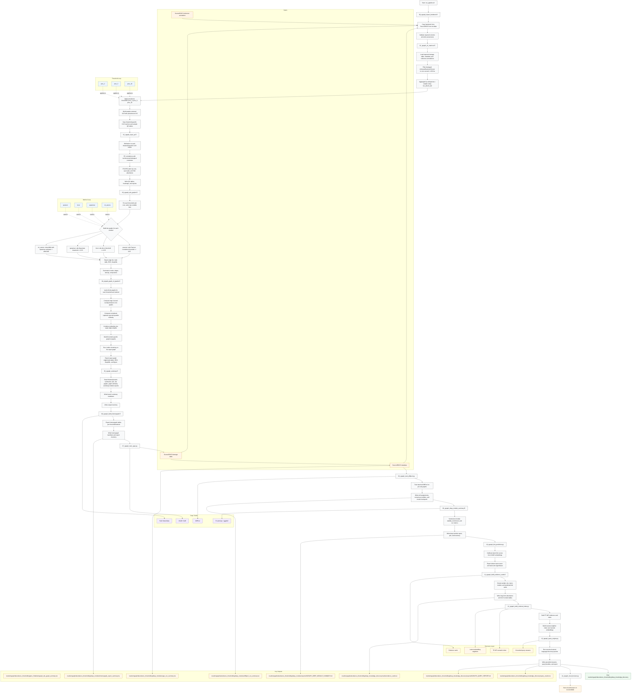

# Current NGraph Workflow v3

- Last updated: 2026-06-19 11:55:12 UTC
- Version: v3

## Key Results

- Site-graph summaries: `results/ngraph/abundance_thresholding/prev_3|prev_5|prev_10/tables/ngraph_site_graph_summary.tsv`
- Graph-of-graphs summaries: `results/ngraph/abundance_thresholding/prev_3|prev_5|prev_10/tables/ngraph_graph_similarity.tsv`
- Heterograph exports: `results/ngraph/abundance_thresholding/deep_modules/heterograph_export_summary.tsv`
- VGAE outputs: `results/ngraph/abundance_thresholding/deep_modules/vgae_run_summary.tsv`, `vgae_embeddings.tsv`, `vgae_taxon_modules.tsv`, `models/vgae_model.pt`
- DiffPool outputs: `results/ngraph/abundance_thresholding/deep_modules/diffpool_run_summary.tsv`, `diffpool_site_taxon_assignments.tsv`, `diffpool_consensus_modules.tsv`, `models/diffpool_model.pt`
- Link prediction outputs: `results/ngraph/abundance_thresholding/deep_knowledge_discovery/link_prediction_summary.tsv`, `link_prediction_top_candidates.tsv`
- Evidence cards: `results/ngraph/abundance_thresholding/deep_knowledge_discovery/cards/evidence_cards.tsv`, `evidence_cards.jsonl`
- Retrieval index: `results/ngraph/abundance_thresholding/deep_knowledge_discovery/indexes/card_tfidf_matrix.npz`, `card_tfidf_vectorizer.pkl`, `vgae_nearest_neighbors.pkl`
- Query outputs: `results/ngraph/abundance_thresholding/deep_knowledge_discovery/query_results.tsv`, `query_results.jsonl`, `reports/NGRAPH_QUERY_REPORT.md`
- Local browser: `scripts/14_ngraph_local_browser.py` bound to `0.0.0.0:8000`, browsing cards, predicted links, modules, embeddings, super-graph views, and live queries

## Coverage Check

- Import step: included
- Canonical `/src/data` feedstock: included
- Threshold loop: `prev_3`, `prev_5`, `prev_10`: included
- CLR build: sample-centered with `tax_abund_tad`: included
- QC step: included
- Site graph methods: `pearson`, `bicor`, `spearman`, `mi_aracne`: included
- Graph-of-graphs step: included
- Deep-module step: included
- Learned link prediction: included
- Evidence cards and retrieval index: included
- Query engine: included
- Local browser: included
