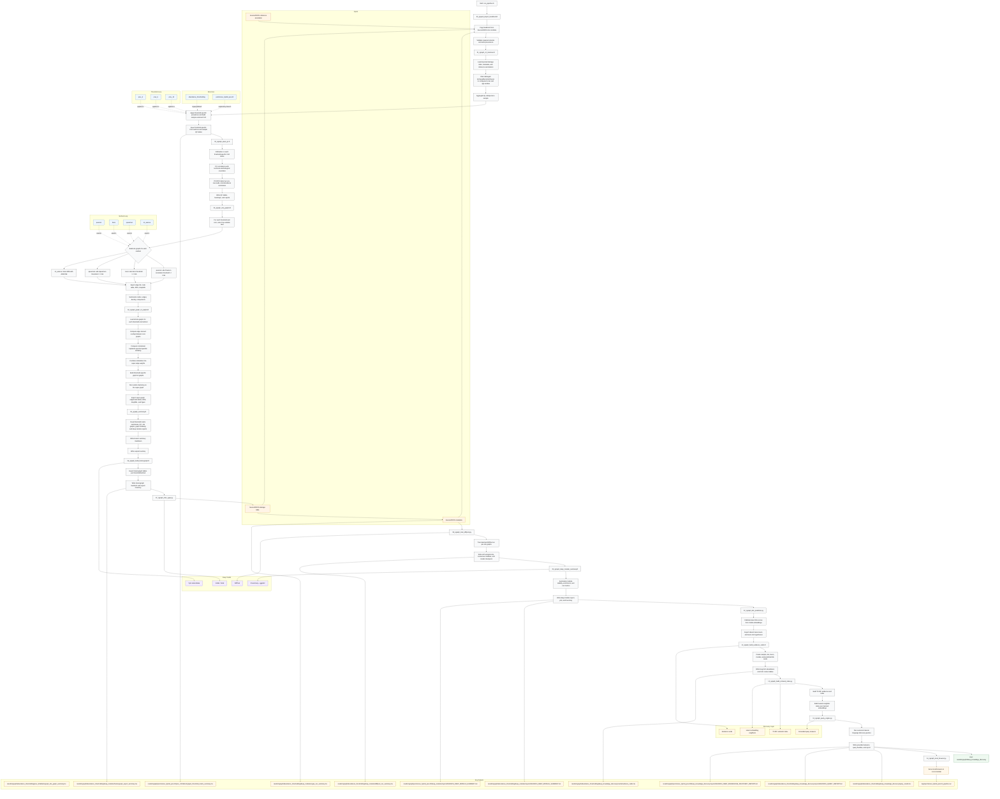

> **Historical workflow snapshot dated 2026-06-25:** This document preserves the workflow and diagrams as recorded at that time. It is not the current implementation status. See [repository review 2026-10-05](LEARNING_AND_NOTES/REPOSITORY_REVIEW_2026-10-05.md) and [current workflow 2026-10-05](current_workflow_2026-10-05.md) for the audited state.

# Current NGraph Workflow v4

- Last updated: 2026-06-25 00:00:00 UTC
- Version: v4

## Current State

- Default production branch remains `abundance_thresholding`.
- Exploratory branch `permissive_hybrid_prev10` is complete and browsable.
- The local browser is serving `permissive_hybrid_prev10` on `0.0.0.0:10298`.
- The permissive branch uses `tax_abund_tad` when available, falling back to `tax_abund_read` for prevalence retention at `prev_10`.
- The permissive run retained `1797` taxa at `prev_10` and completed the full deep-knowledge stack.

## Key Results

- Strict branch outputs remain under `results/ngraph/abundance_thresholding/`.
- Permissive branch outputs live under `results/ngraph/permissive_hybrid_prev10/`.
- The permissive run completed:
  - CLR matrix build
  - input QC
  - site graphs
  - graph-of-graphs
  - heterograph export
  - VGAE and DiffPool training
  - deep-module summary
  - link prediction
  - evidence cards
  - retrieval index
  - query engine
  - local browser exposure

## Operational Notes

- `run_pipeline.sh` now calls `11_ngraph_build_evidence_cards.R` correctly.
- The browser defaults and retrieval/query consumers are parameterized by the configured primary threshold/method.
- The permissive run log is at `logs/permissive_hybrid_prev10_pipeline.out`.

## Coverage Check

- Import step: included
- Canonical `/src/data` feedstock: included
- Threshold loop: `prev_10` complete for permissive branch; `prev_3`, `prev_5`, `prev_10` remain on the strict branch
- CLR build: sample-centered with `tax_abund_tad` and hybrid fallback on permissive branch
- QC step: included
- Site graph methods: `pearson`, `bicor`, `spearman`, `mi_aracne`: included
- Graph-of-graphs step: included
- Deep-module step: included
- Learned link prediction: included
- Evidence cards and retrieval index: included
- Query engine: included
- Local browser: included

