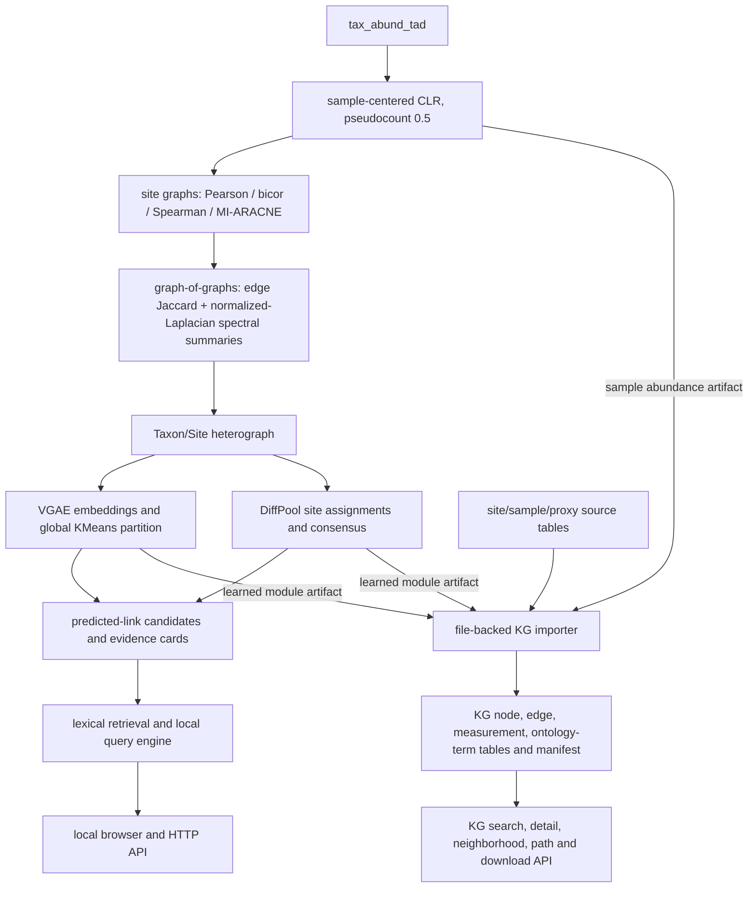

# Audited workflow status — 2026-10-05

This document records the repository state reviewed on 2026-10-05. The detailed findings, evidence locations, limitations and acceptance criteria are in [LEARNING_AND_NOTES/REPOSITORY_REVIEW_2026-10-05.md](LEARNING_AND_NOTES/REPOSITORY_REVIEW_2026-10-05.md). Earlier workflow diagrams remain historical snapshots; this file is the current status view.

## What exists today

**Important separation:** the file-backed KG importer and KG browser endpoints are a parallel substrate. Current VGAE/DiffPool training, link prediction, evidence-card retrieval and natural-language query responses use the graph-learning artifacts; the KG is not yet used by the model or query pipeline. The present KG path endpoint is undirected breadth-first shortest-path search. It does not yet implement typed ordered metapaths, path counts, degree-weighted path counts, permutation significance, or a KG learning task.

## Current evidence status

- The `abundance_thresholding` output covers three prevalence settings by four graph methods. Its twelve VGAE and DiffPool runs have five epochs each and count as smoke runs. The permissive `prev_10` Pearson output has 120 VGAE and 160 DiffPool epochs, but its outputs still lack stability, functional-coherence and suitable held-out validation.
- The KG tables and dashboard endpoints exist, but the KG has 58 dangling control-site edges per branch, proxy unit/matching uncertainty gaps, and all 113 GeoB-specific proxy rows are skipped by a core alias mismatch. The current schema inventory does not enforce a semantic ontology.
- Live endpoint probes succeeded for tested routes, while neighborhood traversal, result limits and taxon-site link filtering have confirmed defects. No full browser UI session or full pipeline rebuild was completed.
- No age-grid alignment, sediment time-warp correction or state-transition learning is implemented. Graph associations and predicted links do not establish ecological interaction, causation, function or seeding recommendations.

## Next prototype sequence

1. Make the run environment and provenance reproducible; fix model checkpoint/split defects and the heterograph prevalence denominator.
2. Repair KG IDs, aliases, dangling references, row-level provenance, units and uncertainty; enforce a bounded typed schema.
3. Demonstrate two or three directed, domain-valid metapaths on the `prev_5`/Pearson baseline, showing path evidence and counts/DWPC while excluding provenance hubs.
4. Evaluate a separate KG-learning task with an independent clean holdout and null/baseline comparisons.
5. Correct and test dashboard navigation, filtering, limits and scientific status labels; then validate the UI in a browser.

Each step and its acceptance criteria are detailed in the repository review. The inspected environment versions are recorded there; they should not be assumed to describe historical model runs.

## MVP implementation update — 2026-10-05

A bounded KG/module prototype is now implemented. The requested read-assisted prevalence filter retains 1,797 taxa in a TAD-only CLR matrix across 200 samples. Of these, 438 have positive TAD evidence and form seven exploratory VGAE groups; all retained taxa remain represented in the KG with read support distinguished from TAD abundance. The KG validates identifiers and references, preserves observation provenance and unmatched proxies, and exposes typed connectivity searches at `http://localhost:10290/kg/paths` with two preset demonstration questions.

The runnable entry point is `bash run_mvp.sh`; `NG_ENV_PREFIX` selects an existing environment, and `NG_BRANCH` selects a fresh output branch. See [implementation plan](LEARNING_AND_NOTES/MVP_IMPLEMENTATION_PLAN_2026-10-05.md) and [verified results and limitations](LEARNING_AND_NOTES/MVP_IMPLEMENTATION_RESULTS_2026-10-05.md). Earlier review sections describe the state before these fixes. Proxy units, GeoB aliases and matching tolerances still need scientific review; typed search is implemented, while KG machine learning and publication-level module validation remain future work.

## Current MVP — permissive mixed sensitivity (2026-10-05)

The current MVP launcher uses `hybrid_aggregated_tad_then_read`: damaged source rows pass the >=100-read gate before aggregation; aggregated TAD values take precedence, with read abundance as fallback for both prevalence (>=10 samples) and the CLR matrix. The mixed run retains 1,797 taxa and 214 samples and learns six exploratory VGAE modules over all retained taxa. The TAD-only run remains a separate comparison. Generic mixed abundance and native TAD-only matrices are saved separately.

The mixed KG now uses curated XRF, user-confirmed GeoB physical-core aliases, depth matches within 0.5 cm and bracketed linear interpolation without extrapolation. Its schema, source-value reconstruction, coverage accounting and GeoB library consistency checks pass. Unknown native units and large interpolation gaps remain explicit. The current browser is `http://localhost:10291/kg/paths`; port 10290 retains the earlier TAD-only prototype. See [current mixed sensitivity and KG report](LEARNING_AND_NOTES/KG_SUBSTRATE_AND_MIXED_SENSITIVITY_2026-10-05.md).

Run a fresh mixed MVP with `bash run_mvp.sh`. To reproduce the TAD-only comparison, use `NG_ABUNDANCE_MODE=hybrid_prevalence_tad_matrix bash run_mvp.sh`. Both commands create a fresh run branch by default.
